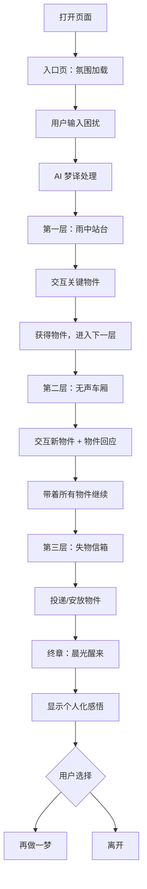

# PRD - 梦境边缘：未寄出的信

## 1. 产品概述
一款基于 AI 梦译机制的沉浸式互动梦境体验。用户输入现实困扰，系统将其转译为象征性的梦境世界，用户通过探索与交互，在梦中完成一次情感旅程，最终自然醒来时获得内心的释然或方向感。
- 面向有压抑、疲惫、迷茫、焦虑等情绪的用户，提供非说教式的情感陪伴
- 展示 AI 作为「可交互外部梦境」的创意应用价值

## 2. 核心功能

### 2.1 用户角色
| 角色 | 核心权限 |
|------|----------|
| 梦境旅人 | 输入困扰、探索梦境、交互物件、完成体验 |

### 2.2 功能模块
1. **入口页（梦的邀请）**：氛围营造、输入引导、进入梦境
2. **第一层 - 雨中站台**：接收用户输入、AI 梦译转染场景、关键物件交互
3. **第二层 - 无声车厢**：承载上一层物件、新的象征性交互、氛围推进
4. **第三层 - 失物信箱**：物件汇聚、情感沉淀、选择与释放
5. **终章 - 晨光醒来**：温柔唤醒、带走感悟、完整收尾

### 2.3 页面详情
| 页面名称 | 模块名称 | 功能描述 |
|---------|---------|---------|
| 入口页 | 梦境邀请 | 深色渐变背景+微弱粒子漂浮、标题淡入、「写下压在你心里的事」输入框、进入按钮带有呼吸光效 |
| 第一层 | 雨中站台 | 灰蓝色雨幕背景、空荡站台、广播声文字化呈现、核心物件：一把旧伞/一张褪色车票/一盏昏黄路灯（根据梦译结果动态选择）、点击物件触发专属动画、获得物件后出现「上车」按钮 |
| 第二层 | 无声车厢 | 深绿绒布色调、摇晃的车厢感、吊环轻摆、窗外景色模糊流动、携带的物件放在身侧座位、新物件：对面空座上的影子/窗上雾气/翻动的书页（梦译影响）、交互后出现「到站了」按钮 |
| 第三层 | 失物信箱 | 暖黄色灯光、老式邮局质感、玻璃柜台、收集到的所有物件陈列、核心交互：将物件投入信箱/放入抽屉/挂在墙上、投递后信箱发光、出现「该醒了」按钮 |
| 终章 | 晨光醒来 | 从黑暗渐变到晨光、简短的个人化醒来文本（基于梦译结果）、温柔的结束语、可选择「再做一梦」或离开 |

## 3. 核心流程



## 4. 用户界面设计

### 4.1 设计风格
- **主色调**：深靛蓝 #0a0e1a → 渐变至午夜蓝 #1a1f3a，点缀暖琥珀色 #d4a574 作为希望之光
- **辅助色**：雨灰 #6b7280、雾白 rgba(255,255,255,0.08)、晨光金 #f0d9a8
- **按钮风格**：细边框圆角、hover 时边框发光、点击后涟漪扩散、文字使用小字号衬线体
- **字体**：
  - 标题：「思源宋体」Source Han Serif / Noto Serif SC — 梦幻文学感
  - 正文：「思源黑体」Source Han Sans — 清晰易读
  - 梦境文本：手写风格引用
- **布局风格**：全屏沉浸式、居中焦点构图、大量留白营造孤独感、物件作为视觉锚点
- **图标/意象风格**：手绘线条风、水彩晕染质感、避免矢量扁平化

### 4.2 页面设计概览
| 页面名称 | 模块名称 | UI 元素 |
|---------|---------|---------|
| 入口页 | 梦境邀请 | 全屏深色背景+漂浮微光粒子、中央竖排标题、底部输入区域带下划线动画、极简进入按钮 |
| 雨中站台 | 站台场景 | CSS 绘制的雨丝动画、站台剪影、物件用 SVG 精细绘制、点击后物件浮起+光晕扩散动画 |
| 无声车厢 | 车厢内部 | 视差滚动窗外景色、CSS 吊环摆动动画、物件陈列区、交互物件悬浮微动效果 |
| 失物信箱 | 信箱场景 | 暖色调玻璃反光效果、物件展示架、信箱投递口交互动画、确认按钮柔和发光 |
| 晨光醒来 | 唤醒画面 | 光线从中心向外扩散、文字逐行淡入、最终画面宁静温暖 |

### 4.3 响应式设计
- 桌面端优先（1200px+ 完整体验）
- 平板适配（768px-1199px）缩放布局
- 移动端（<768px）简化部分动画、保证核心流程完整

### 4.4 动画与音效指引
- **转场动画**：每层切换使用溶解/淡入淡出，时长 1.5s
- **物件交互**：点击反馈 < 300ms、完整动画 1-2s、结束后明确提示下一步
- **环境动画**：雨丝持续下落、车厢轻微摇晃、灯光闪烁（subtle）
- **音效**（可选增强）：雨声白噪音、车轮轨道声、纸张摩擦声、清晨鸟鸣（仅视觉版本亦可）

## 5. AI 梦译机制

### 5.1 输入分类与映射
| 用户输入类型 | 示例原文 | 梦译输出 | 影响范围 |
|------------|---------|---------|---------|
| 疲惫/压力 | "我很累，快撑不住了" | 「背包太重了」 | 站台物件→旧伞、车厢→沉重的影子、终章→放下包袱 |
| 焦虑/恐惧 | "怕做不好，怕让别人失望" | 「前面看不清路」 | 站台物件→熄灭的路灯、车厢→雾窗、终章→光会亮起来的 |
| 迷茫/无方向 | "不知道该怎么办" | 「找不到要坐哪班车」 | 站台物件→空白车票、车厢→时刻表、终章→车会来的 |
| 孤独/无人理解 | "有些话说不出口" | 「信写好了但没有地址」 | 站台物件→旧信封、车厢→空座位、终章→有人会读到的 |
| 关系困扰 | "和某人之间出了问题" | 「两个人隔着玻璃」 | 站台物件→破碎的镜子、车厢→倒影、终章→玻璃可以擦亮的 |

### 5.2 梦译影响链
```
用户输入 → AI 分类 → 选择物件集 → 场景文案调整 → 物件回应文本 → 终章感悟文本
```

## 6. 完成标准
- ✅ 五个完整的沉浸式场景，每个都有独特的视觉氛围
- ✅ 清晰的线性流程：输入 → 三层梦境探索 → 唤醒
- ✅ 每层一个核心物件交互，简单直观不困惑
- ✅ 物件在层级间传递，形成连续性
- ✅ AI 梦译机制隐藏在后端，用户只感受到「梦懂了我」
- ✅ 无任何跳戏内容（比赛说明、技术术语等）
- ✅ 动画精致且符合梦境氛围，非通用特效
- ✅ 文案短促、诗意、不解释
- ✅ 整体体验像一个小型艺术游戏，而非产品 Demo
