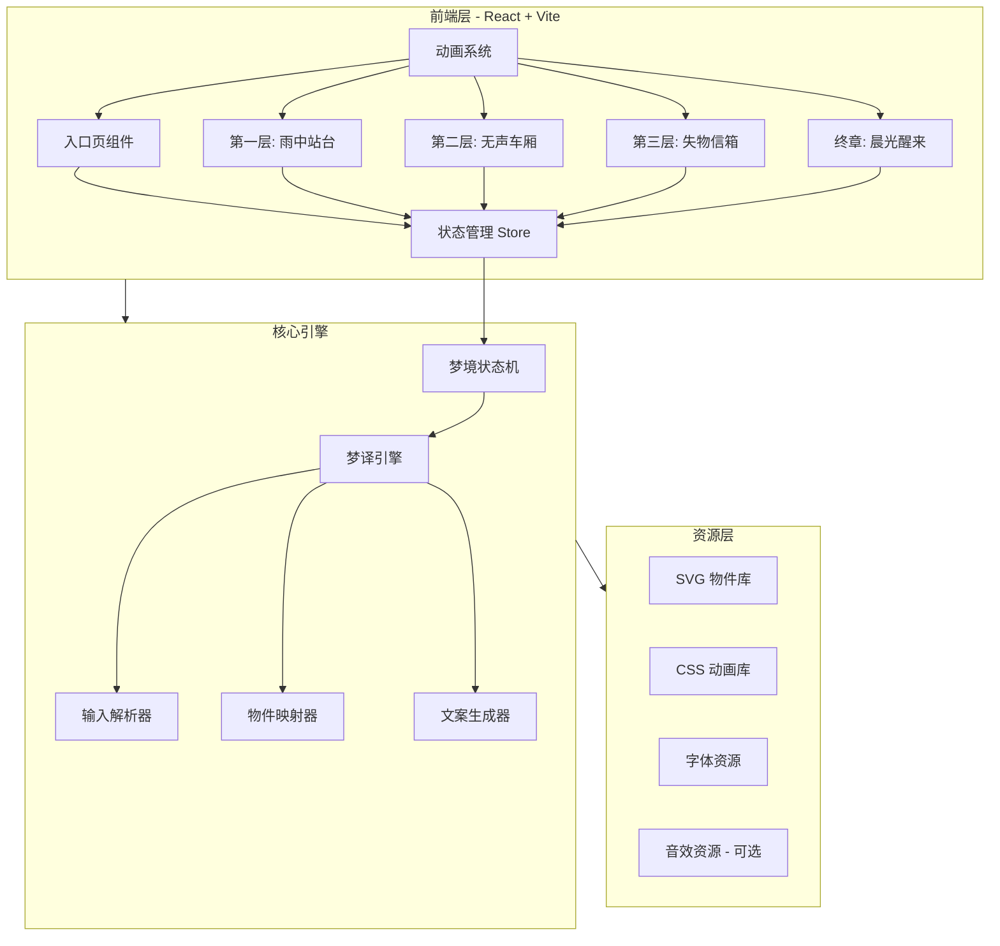
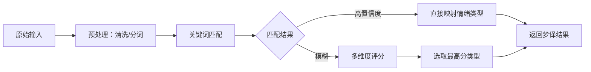

# 技术架构文档 - 梦境边缘：未寄出的信

## 1. 架构设计



## 2. 技术选型

| 技术 | 版本 | 用途 | 选型理由 |
|------|------|------|---------|
| React | 18.x | 核心框架 | 组件化适合场景切换、状态管理清晰 |
| Vite | 5.x | 构建工具 | 快速开发体验、原生 ESM 支持 |
| Tailwind CSS | 3.x | 样式方案 | 快速原型、自定义主题方便 |
| Framer Motion | 11.x | 动画库 | 声明式动画、复杂序列编排能力强 |
| Zustand | 4.x | 状态管理 | 轻量、适合梦境状态流转 |

## 3. 项目结构

```
dream-experience/
├── public/
│   ├── fonts/                    # 思源宋体、思源黑体
│   └── sounds/                   # 可选音效文件
├── src/
│   ├── components/
│   │   ├── scenes/
│   │   │   ├── EntranceScene.tsx      # 入口页
│   │   │   ├── PlatformScene.tsx      # 第一层：雨中站台
│   │   │   ├── CarriageScene.tsx      # 第二层：无声车厢
│   │   │   ├── LetterboxScene.tsx     # 第三层：失物信箱
│   │   │   └── AwakeningScene.tsx     # 终章：晨光醒来
│   │   ├── objects/
│   │   │   ├── DreamObject.tsx        # 物件基础组件
│   │   │   ├── Umbrella.tsx           # 旧伞（疲惫线）
│   │   │   ├── Ticket.tsx             # 空白车票（迷茫线）
│   │   │   ├── Lantern.tsx            # 路灯（焦虑线）
│   │   │   ├── Envelope.tsx           # 旧信封（孤独线）
│   │   │   └── Mirror.tsx             # 破碎镜子（关系线）
│   │   ├── effects/
│   │   │   ├── RainEffect.tsx         # 雨丝动画
│   │   │   ├── ParticleField.tsx      # 粒子场
│   │   │   ├── FogEffect.tsx          # 雾气效果
│   │   │   └── LightTransition.tsx    # 光线过渡
│   │   └── ui/
│   │       ├── DreamInput.tsx         # 梦境输入框
│   │       ├── ContinueButton.tsx     # 继续按钮
│   │       └── DreamText.tsx          # 梦境文本渲染
│   ├── engine/
│   │   ├── dreamTranslator.ts        # 梦译核心逻辑
│   │   ├── objectMapper.ts           # 物件映射器
│   │   ├── textGenerator.ts          # 文案生成器
│   │   └── storylines.ts             # 故事线配置
│   ├── store/
│   │   └── dreamStore.ts             # Zustand 状态管理
│   ├── styles/
│   │   └── globals.css               # 全局样式、CSS 变量
│   ├── App.tsx
│   └── main.tsx
├── index.html
├── tailwind.config.js
├── vite.config.ts
└── package.json
```

## 4. 路由定义

| 路由 | 组件 | 说明 |
|------|------|------|
| / | App（状态机控制） | 根据梦境阶段渲染对应场景组件 |

> 注：本项目采用单页状态机模式而非多路由，所有场景通过 `dreamStore` 中的 `currentPhase` 控制切换。

## 5. 状态管理设计

```typescript
// dreamStore 核心状态结构
interface DreamState {
  // 流程状态
  currentPhase: 'entrance' | 'platform' | 'carriage' | 'letterbox' | 'awakening'
  isTransitioning: boolean

  // 用户输入
  userInput: string
  translatedEmotion: EmotionType

  // 收集的物件
  collectedObjects: DreamObject[]

  // 当前场景数据
  currentSceneData: SceneConfig

  // Actions
  setUserInput: (input: string) => void
  translateAndProceed: () => void
  collectObject: (obj: DreamObject) => void
  nextPhase: () => void
}

type EmotionType = 'exhaustion' | 'anxiety' | 'confusion' | 'loneliness' | 'relationship'
```

## 6. 梦译引擎设计

### 6.1 输入解析流程


### 6.2 物件映射规则
```typescript
const OBJECT_MAP: Record<EmotionType, {
  phase1: DreamObject    // 第一层物件
  phase2: DreamObject    // 第二层物件
  phase3: string         // 第三层投递动作描述
  ending: string         // 终章感悟模板
}> = {
  exhaustion: {
    phase1: { id: 'umbrella', name: '旧伞', ... },
    phase2: { id: 'shadow', name: '沉重的影子', ... },
    phase3: '把伞收起来，放进信箱',
    ending: '你不必一直撑着。雨停的时候，可以把手放下来。'
  },
  // ... 其他情绪类型
}
```

## 7. 动画系统架构

### 7.1 动画分层
| 层级 | 类型 | 实现方式 | 用途 |
|------|------|---------|------|
| 环境层 | 循环动画 | CSS keyframes / Canvas | 雨、雾、粒子、光线 |
| 场景层 | 过渡动画 | Framer Motion AnimatePresence | 场景切换溶解效果 |
| 交互层 | 触发动画 | Framer Motion + GSAP | 物件点击响应、状态变化 |
| 文字层 | 序列动画 | Framer Motion staggerChildren | 文案逐行/逐字显现 |

### 7.2 性能预算
- 首屏加载 < 3s
- 场景切换 < 1.5s
- 交互响应 < 300ms
- 粒子数量上限 100 个
- 使用 `will-change` 和 `transform` 优化动画性能

## 8. 关键技术决策

### 8.1 为什么选择纯前端方案
- 无需后端部署，降低运维复杂度
- 梦译逻辑可嵌入前端（关键词匹配 + 模板生成）
- 后续可接入真实 API 无缝升级

### 8.2 为什么不用 Three.js / 3D
- 2.5D 视觉（CSS + SVG）足够表现梦境氛围
- 降低性能门槛，移动端友好
- 开发效率更高，更易迭代
- 符合「精致美感」要求——手绘风格 SVG 更具艺术感

### 8.3 字体加载策略
- 使用 Google Fonts CDN 加载 Noto Serif SC / Noto Sans SC
- `font-display: swap` 避免阻塞渲染
- 预加载关键字符集

## 9. 数据模型

### 9.1 核心数据类型
```typescript
interface DreamObject {
  id: string
  name: string
  description: string
  svgPath: string           // 内联 SVG 或路径
  animationType: AnimationConfig
  responseText: string      // 点击后的回应文案
}

interface SceneConfig {
  id: string
  background: BackgroundConfig
  ambientEffects: EffectType[]
  primaryObject: DreamObject
  narrativeText: string[]
  atmosphere: string
}
```

## 10. 实现优先级

### P0 - 核心流程（必须实现）
1. 入口页 + 输入框
2. 五个场景的基础切换
3. 至少一套完整故事线（如「疲惫」线）的全流程
4. 物件交互 + 收集机制
5. 场景转场动画

### P1 - 体验完善（应当实现）
6. 全部五套故事线的物件和文案
7. 梦译关键词匹配引擎
8. 所有环境动画（雨、雾、光）
9. 终章个性化文本

### P2 - 精致打磨（最好实现）
10. 微交互细节（hover 状态、loading 态）
11. 音效系统（可选）
12. 移动端适配优化
13. 「再做一梦」重置功能
14. 性能监控与优化
