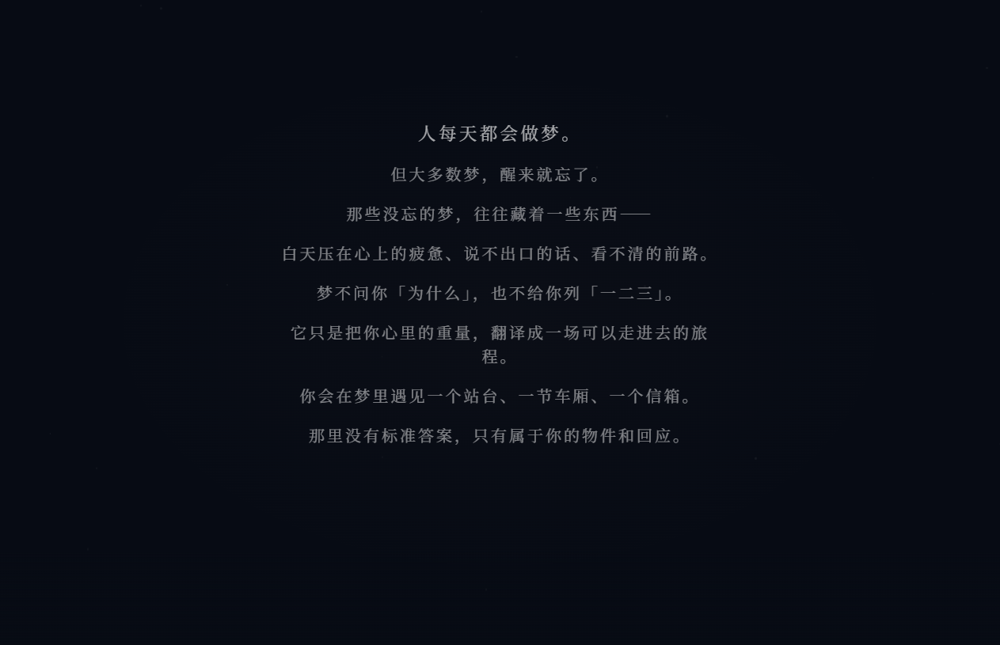
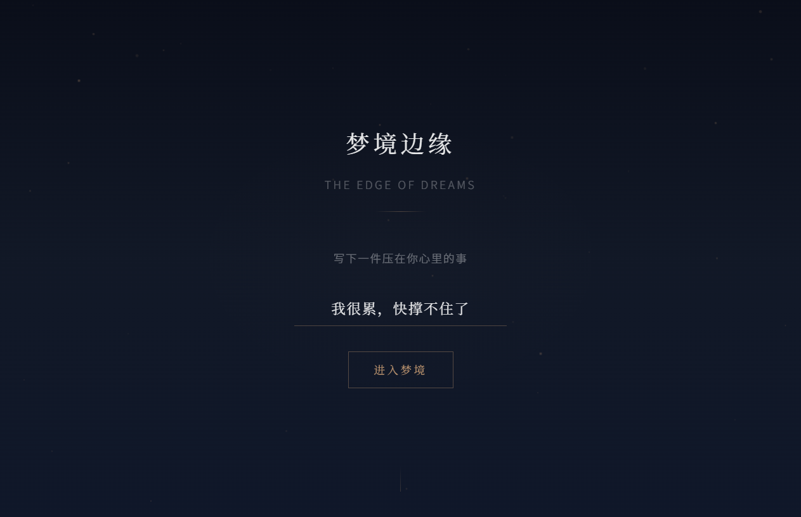
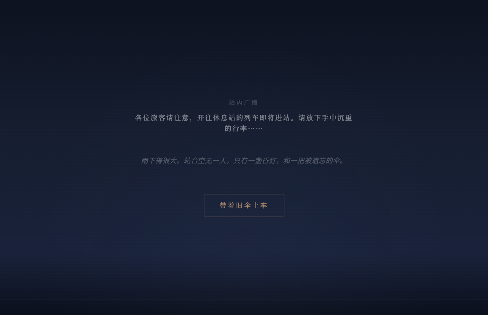
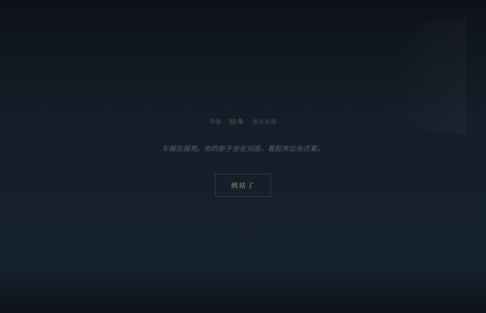
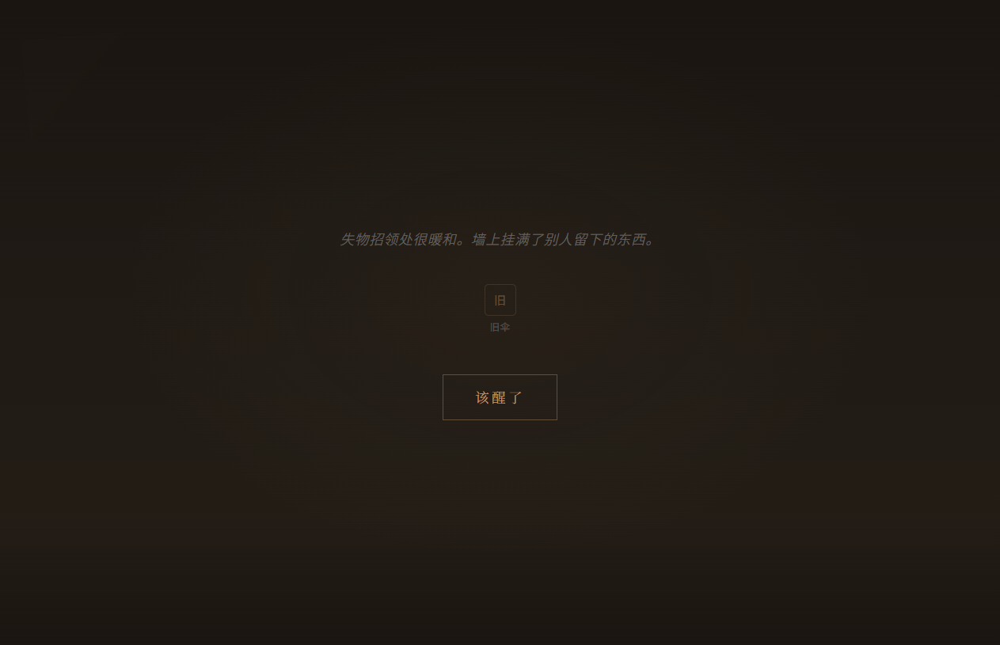
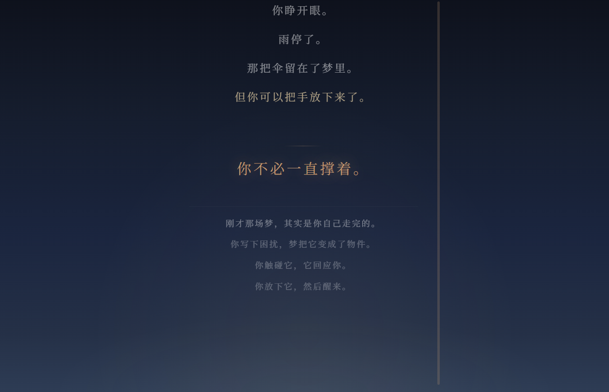

# 【标签】生活娱乐

# 【标题】生活娱乐 | 梦境边缘：未寄出的信 — AI 造梦互动体验

---

## 1. Demo 简介

**是什么：** 一个基于「AI 造梦」机制的互动式网页体验（单文件 HTML，双击即可打开）。用户输入现实中压在心里的情绪，系统不直接给建议，而是像大脑做梦一样——把那些沉重的东西，「翻译」成一场可以走进去的梦境。你在梦中触碰物件、获得回应，最后自然醒来，带走一点感受。

**面向谁：** 刚离开校园进入职场的年轻人、背井离乡的北漂/沪漂深漂、加班到深夜不知道跟谁说话的人、有情绪但不想对任何人说出口的人。不是心理咨询工具，而是一个让你「被梦接住」的地方。

**主要功能：**

- **AI 梦译引擎** — 用户输入原始文字（如"我很累，快撑不住了"），系统通过关键词匹配识别情绪类型，自动匹配专属的梦境物件链、场景文案和终章感悟。AI 的存在完全藏在机制里，玩家只感受到「梦懂了我」，而不是「AI 在分析我」。
- **6 层沉浸式梦境叙事** — 开篇故事（关于梦与 AI 的叙述）→ 情绪引导与放松呼吸 → 输入入口 → 雨中站台（拾取物件）→ 无声车厢（物件回应）→ 失物信箱（投递释放）→ 晨光醒来（个人化感悟 + 收尾沉淀）。每层承接上一层的物件和选择，故事完整连续。
- **实时交互动画** — CSS 雨丝动画、车厢摇晃效果、物件悬浮回应、Framer Motion 场景转场、逐行文字显现。每层只有一个关键动作，交互简单清晰，像进入一场真实的梦。

**效果预览：**

| 开篇故事 | 输入入口 | 雨中站台 |
|:---:|:---:|:---:|
|  |  |  |

| 无声车厢 | 失物信箱 | 晨光醒来 |
|:---:|:---:|:---:|
|  |  |  |

> 完整体验请打开 `dream-experience.html`（单文件可体验版本，无需服务器，无需安装依赖）

---

## 2. Demo 创作思路

### 灵感来源：一个北漂深夜的念头

我是一个刚结束大学生活、来北京工作的职场新人。

一个人搬到陌生的城市，租了一间不大的房子，每天挤地铁上班，下班回来面对空荡荡的房间。有些话不想发朋友圈，不想跟爸妈说怕他们担心，跟同事说又不合适，跟朋友说大家都很忙。

然后我发现：**人其实每天都会做梦。**

梦是一个神奇的东西——它不会问你「为什么」，也不会给你列「你应该怎么做」。它只是把你白天压在心上的东西，翻译成另一种语言。一把伞、一盏灯、一列没有其他乘客的车、一封写好了但没有地址的信。你醒来的时候，不一定记得全部细节，但心里好像轻了一点。

### 核心发现：AI 造梦，和真实的梦，几乎是一样的

在做这个项目的过程中，我深入思考了一个问题：**人脑做梦的机制，和大语言模型（LLM）生成内容的工作范式，是不是高度同构？**

答案是惊人的「是」。具体来说：

| 人脑做梦 | 大模型生成 (AI 造梦) | 本质 |
|:---|:---|:---|
| 脑干发出随机的碎片化神经电信号（激活） | 根据 Prompt 预测下一个 Token | **激活-合成** |
| 大脑皮层强行将碎片拼接成看似连贯的故事 | 模型通过自回归一步步「合成」合理的后续 | 局部概率→全局连贯 |
| 前额叶（逻辑区）下线，所以梦荒诞但你不怀疑 | 缺乏真正的世界模型，所以会产生幻觉 | **逻辑缺失** |
| REM 睡眠中将短期记忆整合归档到皮层 | RAG 检索外部知识补充上下文窗口 | 记忆重组 |
| 潜意识设定梦境基调和角色 | System Prompt 设定回答风格和人设边界 | 角色设定 |
| 清醒梦中意识到自己在做梦，从而能控制走向 | RLHF 让模型学会安全、有用、符合价值观 | 对齐约束 |

**所以我们正在构建的，本质上是一个「清醒的数字做梦者」。**

大模型目前的本质，就是一个被限制在文本概率空间里的「做梦机器」。人类做梦是为了处理情绪和巩固记忆，而 AI 「做梦」（生成文本）是为了完成人类下达的意图。

这个作品就是一次实验：**如果让 AI 像人脑一样「做梦」来处理人的情绪，会是什么样子？**

### 想解决的问题

现代人的情绪困境往往不是缺「建议」——网上到处是「你应该怎么做」「你要学会释怀」「你可以试试运动」。真正缺的是一个**不被评判的空间**，一个可以把那些说不出口的东西换一种方式看见的地方。

特别是对于我们这一代人：
- 背井离乡来到大城市，社交圈子从同学变成同事，能说真心话的人越来越少
- 职场压力不敢跟家人说（怕他们担心），不能跟同事说（不合适），朋友又各忙各的
- 深夜emo的时候，连个可以发消息的人都要斟酌半天
- 不是需要有人告诉我答案，只是希望有人能接住这些情绪，哪怕是以一种非理性的方式

### 为什么做这个方向

**取舍一：不做选择题，做物件交互。** 很多互动叙事作品退化为「A/B/C 选选项」。我选择每层只让玩家做一个关键动作——点一个梦中物 → 物件进入口袋 → 带着它进入下一站。简单、清晰、有仪式感。就像梦里你不需要做决定，只需要去触碰。

**取舍二：AI 藏在机制里，不写在脸上。** 界面上没有任何「AI 正在分析」「大模型生成」的提示。用户只看到：我写下了一句话 → 梦里的东西变了 → 好像懂我了。AI 的存在感来自体验，而非说明。因为梦从来不会告诉你「我在帮你处理情绪」。

**取舍三：故事完整，不做散乱片段。** 每一层都严格承接上一层的物件。《最后一班梦车》的结构——旧候车厅 → 没有乘客的车厢 → 失物招领处 → 醒来——每一步都有因果。就像真实的梦一样，虽然荒诞但有内在逻辑。

**取舍四：游戏内零跳戏。** 没有比赛字样、没有产品化文案、没有 AI 说明、没有 prompt 提及。玩家打开后只知道：我在一个梦里。这是对「AI 是外部梦境」这个立意的尊重——梦不会跳出来解释自己。

### 当前实现与未来方向

**当前版本（演示版）：** 基于关键词匹配的逻辑实现。维护了 5 组关键词映射表，覆盖疲惫/焦虑/迷茫/孤独/关系困扰 5 种常见情绪类型，每种对应一条完整的梦境叙事链。这是一个可以完整体验的 MVP。

**未来方向：接入大语言模型能力。** 关键词匹配的本质是「规则引擎」，它能工作但不够灵活。未来的计划是：

1. **用 LLM 替代关键词匹配** — 用户输入的自然语言经过大模型理解后，生成因人而异的梦境转译，而不是机械地匹配预设关键词
2. **动态生成梦境内容** — 物件、场景描述、回应文本都由 LLM 根据用户的实际输入实时生成，每个人的梦都不一样
3. **更深层的情感理解** — 不只是分类「你是焦虑还是疲惫」，而是理解「你为什么焦虑」「这件事对你意味着什么」，然后生成真正有针对性的梦境隐喻
4. **多轮对话式梦境** — 从单次体验到持续陪伴，像一个每晚都会等你的「数字梦境」

最终愿景：**让每个人都能拥有一个属于自己的、因人而异的 AI 梦境。一个不会评判你、只会用象征语言轻轻接住你的地方。**

---

## 3. Demo 体验地址

**方式：交互式可体验 HTML 文件（ZIP 打包上传）**

- 文件名：`dream-experience.html`
- 大小：约 301KB（单文件，内联所有代码）
- 运行方式：**双击即可在浏览器中打开**，无需服务器、无需 npm install、无需任何环境配置
- 依赖：仅 Google Fonts（思源宋体/黑体）通过 CDN 加载

**技术栈：** React 18 + TypeScript + Framer Motion + Zustand + Vite（构建时打包为单文件）

**5 条故事线一览（当前演示版）：**

| 用户情绪 | 示例输入 | 梦译输出 | 第一层物件 | 终章感悟 |
|:---:|:---:|:---|:---:|:---:|
| 疲惫 | "我很累，快撑不住了" | 「背包太重了」 | 旧伞 | 你不必一直撑着 |
| 焦虑 | "怕做不好，怕让人失望" | 「前面看不清路」 | 路灯 | 光会亮起来的 |
| 迷茫 | "不知道该怎么办" | 「找不到要坐哪班车」 | 空白车票 | 车会来的 |
| 孤独 | "有些话说不出口" | 「信写好了但没有地址」 | 旧信封 | 有人会读到的 |
| 关系困扰 | "和某人之间出了问题" | 「两个人隔着玻璃」 | 碎镜 | 玻璃可以擦亮的 |

> 未来接入 LLM 后，每个输入都将获得独一无二的梦境体验，不再局限于预设的 5 种类型。

---

## 4. TRAE 实践过程

本项目从需求分析到代码实现，全部使用 **TRAE IDE** 完成。以下是完整的开发流程：

### 第一步：需求分析与架构设计

基于用户的原始 PRD 文档（《原prd.md》）和个人创作意图（《梦与AI.md》中的核心思考），TRAE 分析并生成了完整的产品需求文档和技术架构方案，包括：
- 故事线设计（5 种情绪 × 5 层场景 × 物件链）
- 场景规划（Intro → Entrance → Platform → Carriage → Letterbox → Awakening）
- 交互定义（点击物件 → 回应动画 → 继续按钮 → 下一层）
- 技术选型（React + Framer Motion + Zustand + Tailwind CSS）

### 第二步：项目初始化与环境搭建

使用 TRAE 执行以下操作：
- `npm create vite@latest dream-experience -- --template react-ts` 初始化项目
- 安装依赖：`framer-motion`、`zustand`、`tailwindcss` 等
- 搭建全局样式系统：CSS 变量定义梦境主题色（深靛蓝底 `#0a0e1a` + 琥珀金点缀 `#d4a574`）、字体系统（思源宋体标题 + 思源黑体正文）、动画变量

### 第三步：核心引擎开发（3 个模块）

由 TRAE 逐步实现三大核心模块：

1. **[storylines.ts](src/engine/storylines.ts)** — 5 条完整故事线数据配置
   - 每条线包含：开场广播、场景描述、物件名称/图标/描述、物件回应文本、终章感悟、收尾长文
   - 数据驱动设计，新增故事线只需添加配置对象

2. **[dreamTranslator.ts](src/engine/dreamTranslator.ts)** — 关键词梦译引擎
   - 维护 5 组关键词映射表（疲惫/焦虑/迷茫/孤独/关系）
   - 输入原始文本 → 分词 → 匹配关键词 → 返回 EmotionType + 梦境短语
   - 例如："我很累" → 匹配 "累" → exhaustion 类型 → "背包太重了"

3. **[objectMapper.ts](src/engine/objectMapper.ts)** — 物件映射器
   - 根据情绪类型返回对应的故事线完整数据
   - 提供 `getStoryline(emotion)` 和 `getObjectForPhase(emotion, phase)` 接口

### 第四步：状态管理与场景组件实现

- **[dreamStore.ts](src/store/dreamStore.ts)** — Zustand 状态机
  - 管理 6 个阶段流转：intro → entrance → platform → carriage → letterbox → awakening
  - 追踪：用户输入、梦译结果、收集的物件、各阶段完成状态
  - 支持 URL 参数调试模式（`?phase=platform` 直接跳转到指定场景）

- **6 个场景组件逐一实现：**
  - [IntroScene.tsx](src/components/scenes/IntroScene.tsx) — 开篇故事（10段逐行显现）+ 4步引导（情绪引入→梦境概念→深呼吸→进入邀请）+ 呼吸圆环动画
  - [EntranceScene.tsx](src/components/scenes/EntranceScene.tsx) — 40个漂浮粒子 + 梦境输入框 + 进入按钮
  - [PlatformScene.tsx](src/components/scenes/PlatformScene.tsx) — CSS 雨丝动画 + 站内广播 + 物件拾取 + "带着XX上车"
  - [CarriageScene.tsx](src/components/scenes/CarriageScene.tsx) — 车厢摇晃动画 + 吊环摆动 + 影子物件回应 + "到站了"
  - [LetterboxScene.tsx](src/components/scenes/LetterboxScene.tsx) — 暖黄光晕背景 + 物件展示架 + 投递释放 + "该醒了"
  - [AwakeningScene.tsx](src/components/scenes/AwakeningScene.tsx) — 光线扩散渐变 + 个人化感悟 + 8段收尾沉淀长文 + "再做一梦"

每个场景都有独特的视觉氛围与 Framer Motion 动画编排，场景间使用 `AnimatePresence` 实现模糊淡出溶解转场（1.5s）。

### 第五步：调试、优化与迭代

过程中遇到的问题均由 TRAE 协助解决：
- 修复 IntroScene 导入路径错误（`../store` → `../../store`）
- 解决 Node 16 版本兼容性问题（`--legacy-peer-deps`）
- 处理缺失依赖（`fast-glob`、`@babel/traverse`）
- 多轮迭代优化：添加前序引导（从直接进入变为4步情绪铺垫）→ 精简引导文案 → 增加开篇10段叙述 + 终章8段收尾长文
- 构建 ZIP 可体验版本：集成 `vite-plugin-singlefile` 将整个项目打包为单文件 HTML（301KB）

---

### 项目结构总览

```
dream-experience/
├── src/
│   ├── engine/                    # 核心引擎
│   │   ├── storylines.ts          # 5条完整故事线配置
│   │   ├── dreamTranslator.ts     # 关键词梦译引擎 (当前) / LLM接口 (未来)
│   │   └── objectMapper.ts        # 物件映射器
│   ├── store/
│   │   └── dreamStore.ts          # Zustand 状态机 (6阶段)
│   ├── components/scenes/         # 6个沉浸式场景
│   │   ├── IntroScene.tsx         # 开篇故事 + 引导 + 呼吸动画
│   │   ├── EntranceScene.tsx      # 粒子 + 输入框
│   │   ├── PlatformScene.tsx      # 雨丝 + 广播 + 物件拾取
│   │   ├── CarriageScene.tsx      # 摇晃 + 影子回应
│   │   ├── LetterboxScene.tsx     # 信箱 + 投递释放
│   │   └── AwakeningScene.tsx     # 光线 + 感悟 + 收尾
│   ├── styles/globals.css         # 梦境主题样式
│   └── App.tsx                    # 主组件 + 场景转场 + URL参数调试
├── dream-experience.html          # ★ 单文件可体验版本 (301KB)
├── showcase.html                  # 项目展示页（含截图+技术说明）
├── screenshots/                   # 各场景截图 (7张)
├── 原prd.md                       # 原始产品需求文档
├── 梦与AI.md                       # 核心立意：人脑做梦 vs AI生成的深度分析
└── package.json
```
### Session ID
需求缘起：.3651926231103063:87cfaa13ecb9ec18d06b9acc91c3ff8d_6a361c9adf35a2099e3de74f.6a3634de2111eac5b5bf057f.6a3634dd8c47bd515a79fe9f:Trae CN.T(2026/6/20 14:36:14)
丰富内容：.3651926231103063:10ec51ca799e687e8ee34700c99f48cf_6a361c9adf35a2099e3de74f.6a363a152111eac5b5bf0708.6a363a148c47bd515a79fea1:Trae CN.T(2026/6/20 14:58:29)
丰富内容+1：.3651926231103063:36975332626e8e96b2731e5f1d1345dc_6a361c9adf35a2099e3de74f.6a363be72111eac5b5bf07df.6a363be68c47bd515a79fea3:Trae CN.T(2026/6/20 15:06:15)
展示页面：.3651926231103063:58c75208b82b54eeeaa7dd772eb1ac2b_6a361c9adf35a2099e3de74f.6a363e0b2111eac5b5bf07f8.6a363e0a8c47bd515a79fea4:Trae CN.T(2026/6/20 15:15:23)
以终为始：.3651926231103063:df4f4dd18fc1ce94d34b14f7809b1bf8_6a361c9adf35a2099e3de74f.6a364c8f2111eac5b5bf0e1c.6a364c8e8c47bd515a79fea8:Trae CN.T(2026/6/20 16:17:19)

---

**联系方式：** PM小董 | 邮箱：2609590748@qq.com

---

*天亮了。今天的事，慢慢来就好。*
