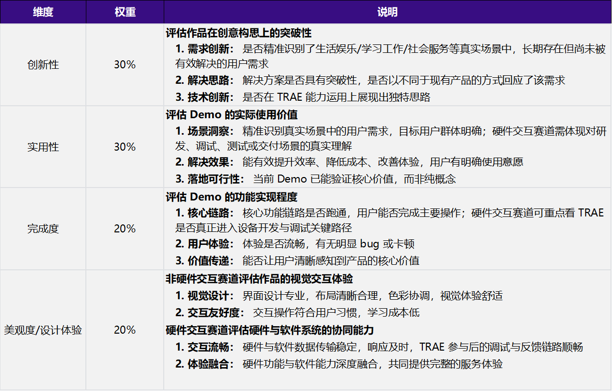

Demo 作品帖怎么写（推荐模板）
在初赛专区发帖，按下面的格式填写。重点是把「用 TRAE 做出来」的过程讲清楚。

【标签】 按所选赛道选择话题标签：生活娱乐/ 学习工作/ 社会服务/ 硬件交互，必须四选一；参加附加赛题的还可加选 社会公益 标签。（需要跟报名通过的赛道保持一致）

【标题】 报名赛道 + Demo 名称

【正文】 至少包含以下 4 个部分，可以增加额外的部分（比如经验总结，开发心得等）

1. Demo 简介

是什么：一句话说清你的产品形态（App / 小程序 / 网站 / 系统 / 硬件等）；

面向谁：核心用户是哪些人；

主要功能：列出 2–3 个核心功能，建议配产品截图或界面展示，让评审一眼看懂。

2. Demo 创作思路

灵感来源：你为什么想到做这个；

想解决的问题：用户真实存在的痛点；

为什么做这个方向：你的判断和取舍。

3. Demo 体验地址（三选一）

部署随时可公开访问的体验链接；

交互式可体验的HTML格式文件，请使用Zip格式打包上传到社区；

硬件交互赛道可用演示视频替代在线体验（视频请上传第三方平台后附公开链接）。

4. TRAE 实践过程

清晰展示用 TRAE 完成 Demo 开发的完整流程；

附开发关键步骤截图（不少于 3 张）；

附关键任务对话的 Session ID（不少于 3 个），用于证明作品由 TRAE 开发完成。

评分标准
